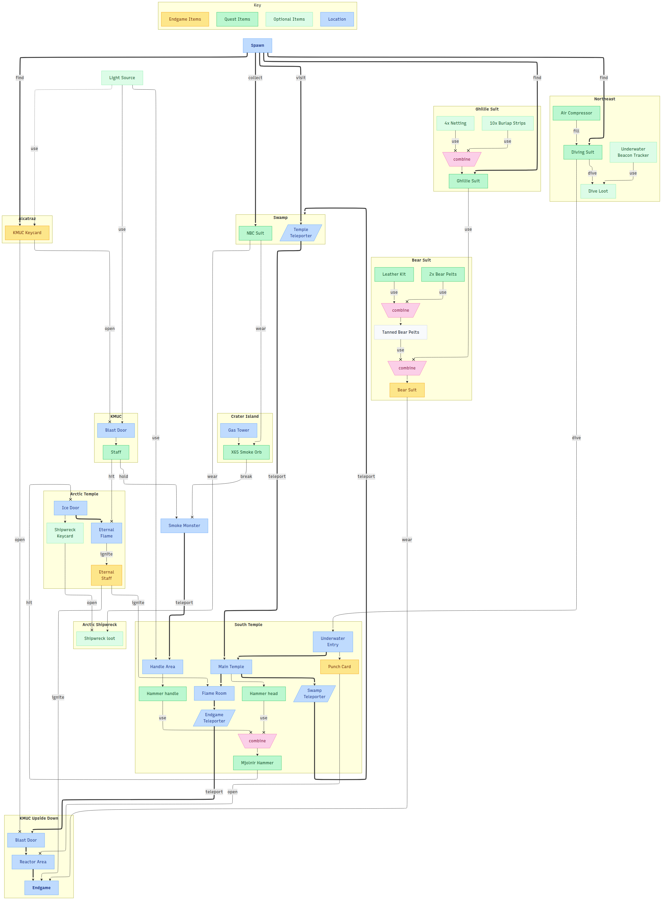

# Deer Isle Endgame Quest

## Loot Flow

This [flowchart](deer-isle-endgame-loot-flow.mmd) outlines the loot items required to complete the
Endgame quest. It describes their dependencies and the overall progression leading up to the Endgame
quest.

Survivors can use this flowchart to plan and navigate through the quest efficiently.

_(Open image in a new tab to view full size.)_

[](docs/generated/deer-isle-endgame-loot-flow.png)

## How to Contribute

If you have suggestions for improvements or want to contribute, feel free to create an
[issue](https://github.com/deer-isle-quest/issues) or fork this repository and submit a pull request
with your changes.

The flowchart is created using [Mermaid](https://mermaid-js.github.io/mermaid/#/) syntax. You can
edit the `.mmd` file using any text editor, then preview it using a Mermaid-compatible viewer such
as
[Mermaid Charts for Visual Studio Code](https://marketplace.visualstudio.com/items?itemName=MermaidChart.vscode-mermaid-chart).

Please avoid making large structural changes to the flowchart or repo without discussing them first,
as it may result in your PR being delayed or rejected.

### Generating the Image

The PNG image associated with the Mermaid diagram is **auto-generated** when a pull request
containing the changes is created or updated. You can manually generate the image using the
following procedure:

1. Install the preferred font

   Download `Recursive` from [Google Fonts](https://fonts.google.com/specimen/Recursive) and install
   it on your local computer.

2. Install Node.js and npm if you haven't already

   You can download Node.js from the [official website](https://nodejs.org/). npm is included with
   Node.js.

3. Use the Mermaid CLI to generate the image

```bash
# Optional: Install the Mermaid CLI globally to increase startup performance on subsequent runs
npm install -g @mermaid-js/mermaid-cli

# Run the following command to generate an image from an .mmd file...
npx -p @mermaid-js/mermaid-cli mmdc -i ./deer-isle-endgame-loot-flow.mmd -o ./docs/generated/deer-isle-endgame-loot-flow.png -w 100000 -H 100000 -c ./docs/generated/mermaid-config.json -p ./docs/generated/puppeteer-config.json
```

## Acknowledgements

The Deer Isle map was created by [John McLane](https://x.com/JohnMcLane666). Special thanks to him,
the DayZ developers, and [Holly Rex](https://www.twitch.tv/hollyrex) who explored the game world
extensively.
