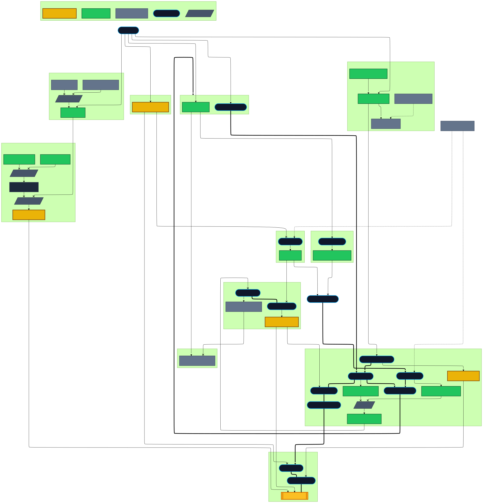

# Deer Isle Endgame Quest

## Loot Flow

This [flowchart](deer-isle-endgame-loot-flow.mmd) presents a tactical breakdown of the Deer Isle
Endgame loot progression. It outlines the loot items required to complete the Endgame quest,
describes their dependencies, and shows the overall progression leading up to the Endgame quest.

DayZ Survivors can use this flowchart to plan and navigate through the quest efficiently.

> _WARNING_: The diagram contains spoilers. Do not view it if you want to experience the quest
> without prior knowledge of the loot progression.

_(Open image in a new tab to view full size.)_

[](docs/generated/deer-isle-endgame-loot-flow.svg)

## Interactive Tracker

The [interactive quest tracker](https://mrfootoyou.github.io/deer-isle-quest/) turns the loot flow
into a progress planner. Click tickable loot nodes on the map or choose an item from **Next
actions** to mark it collected. The sidebar ranks currently available required items by distance to
ENDGAME and keeps optional finds separate.

Progress is stored as an item inventory in the browser. Quantity-bearing items display counts such
as `Bear Pelts 1 of 2`; plain clicks toggle quantity-one items or increment plural items. Use
Shift/Ctrl-click, right-click, or the keyboard decrement shortcut to reduce counts. Crafting nodes
consume the exact quantities declared by their recipe edges and create the resulting item.

The **Share** control encodes the inventory as a versioned base64url JSON payload in the URL hash
using the `#i=` prefix. This replaces the former fragile boolean bitmask format.

### Running the Tracker Locally

```powershell
Push-Location site
npm ci
npm run dev
Pop-Location
```

The production build can be checked with `npm run build` from `site/`. The GitHub Pages workflow
deploys the `site/dist` output whenever the site or canonical graph data changes. The first time,
set **Settings → Pages → Source** to **GitHub Actions** in the repository.

### Testing and Integrity Checks

Run the formal Vitest domain suite from `site/`:

```powershell
npm test -- --run
```

The suite covers state resolution, progression gates, distances, frontier ranking, quantity-aware
crafting, repeated crafting, singular-item toggles, and plural-item decrement behavior. The older
human-readable diagnostic remains available with:

```powershell
npm run verify:domain
```

From the repository root, verify that `data/loot-flow.json` remains synchronized with the Mermaid
source:

```powershell
npm run check:integrity
```

These checks run automatically in `.github/workflows/test.yml` for pull requests and relevant
pushes.

## How to Contribute

If you have suggestions for improvements or want to contribute, feel free to create an
[issue](https://github.com/deer-isle-quest/issues) or fork this repository and submit a pull request
with your changes.

The flowchart is created using [Mermaid](https://mermaid-js.github.io/mermaid/#/) syntax. You can
edit the `.mmd` file using any text editor, then preview it using a Mermaid-compatible viewer such
as
[Mermaid Charts for Visual Studio Code](https://marketplace.visualstudio.com/items?itemName=MermaidChart.vscode-mermaid-chart).

Please avoid making large structural changes to the flowchart or repo without discussing them first,
as it may result in your PR being delayed or rejected.

### Generating Diagram Images

The PNG and SVG images associated with the Mermaid diagram are **auto-generated** when a diagram
change is pushed to a GitHub PR. You can manually generate the images by executing:

```powershell
./build.ps1 build
```

It is recommended to use the Docker-based Mermaid CLI for consistent results across different
environments. You can force the use of Docker, even if you have a local installation of Mermaid CLI
available, by adding the `-UseDocker` flag: `./build.ps1 build -UseDocker`

## Acknowledgements

The Deer Isle map was created by [John McLane](https://x.com/JohnMcLane666). Special thanks to him,
the DayZ developers, and [Holly Rex](https://www.twitch.tv/hollyrex) who explored the game world
extensively.
